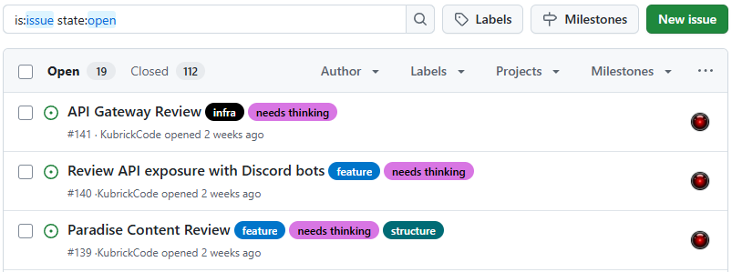
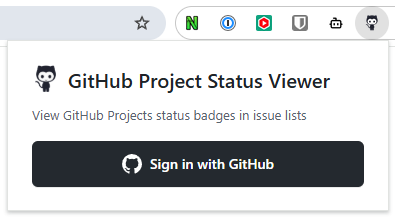
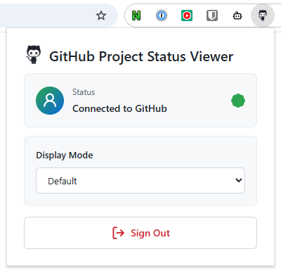

# GitHub Project Status Viewer

A Chrome extension that displays GitHub Projects status directly in your repository's issue list.

## Before & After

<table>
<tr>
<th>Before</th>
<th>After</th>
</tr>
<tr>
<td></td>
<td></td>
</tr>
</table>

## Demo

### Dark Mode

## Extension Popup

<table>
<tr>
<td width="50%">

### Login

</td>
<td width="50%">

### Connected

</td>
</tr>
</table>

## Features

- 🏷️ Automatically shows project status badges next to each issue
- 🎨 Color-coded badges matching actual GitHub Projects status colors
- 🌓 Dark mode support - badges adapt to GitHub's theme
- 📐 Display mode options - choose between default (with text) or compact (color dot only) badges
- 🔄 Detects projects automatically from each issue's connections
- ⚡ Fast loading with efficient GitHub GraphQL API
- 🔐 Secure OAuth authentication with automatic token refresh
- 🚀 One-click login - no manual token management required

## Installation

[Install from Chrome Web Store](https://chrome.google.com/webstore) _(link will be available once published)_

## Quick Start

1. **Install the Extension**

   Click "Add to Chrome" from the Chrome Web Store

2. **Sign in with GitHub**
   - Click the extension icon in your Chrome toolbar
   - Click "Sign in with GitHub"
   - Authorize the application when prompted

3. **Done!**

   Visit any GitHub repository's issues page and see status badges appear automatically

## Usage

Simply navigate to any GitHub repository's issues page (e.g., `https://github.com/owner/repo/issues`). The extension will:

- Automatically detect which projects each issue belongs to
- Display status badges next to issue titles
- Use colors matching your GitHub Projects status field configuration

### Display Modes

You can customize how status badges appear:

- **Default**: Shows full status text with colored background (e.g., "In progress")
- **Compact**: Shows only colored dots - hover to see status text

To change display mode:

1. Click the extension icon in your Chrome toolbar
2. Select your preferred mode from the "Display Mode" dropdown
3. Badges update instantly on all open GitHub issue pages

No other configuration needed - it just works!

## FAQ

**Q: Do I need a GitHub Personal Access Token?**
A: No! The extension uses OAuth - just click "Sign in with GitHub" and authorize the app.

**Q: Is my GitHub token safe?**
A: Yes. Access tokens are stored in session storage (deleted when you close the browser), and the OAuth client secret is never exposed to your browser.

**Q: Which projects does it support?**
A: GitHub Projects V2 only (the new projects interface).

**Q: What if an issue is in multiple projects?**
A: The extension shows the status from the first connected project.

**Q: Does it work on private repositories?**
A: Yes, as long as you've authorized the extension to access your repositories.

## Privacy & Security

- 🔐 OAuth authentication - no need to create personal access tokens
- 🔒 Access tokens stored in session storage (automatically deleted when browser closes)
- 🛡️ OAuth client secret never exposed to your browser (server-side only)
- ✅ Automatic token refresh - no manual re-authentication needed
- 🎯 Minimal permissions - only requests `read:project` and `repo` access

## Support

Found a bug or have a feature request? [Open an issue](https://github.com/yourusername/github-project-status-viewer/issues) on GitHub.

## License

MIT
